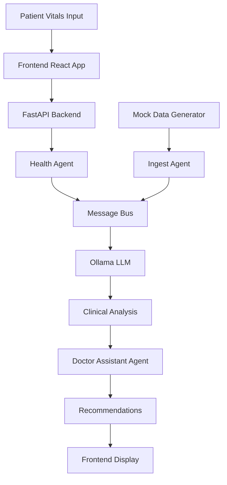

# MediBot AI - Technical Architecture Document

##  System Overview

MediBot AI is a multi-agent healthcare monitoring system that combines real-time vital signs analysis with AI-powered clinical decision support.

## 🎯Core Components

### 1. Frontend Layer (React + Vite)
```
src/
├── components/          # Reusable UI components
├── pages/              # Application pages
├── hooks/              # Custom React hooks
├── services/           # API service layer
├── utils/              # Utility functions
└── types/              # TypeScript definitions
```

**Technologies:**
- React 18 with TypeScript
- Vite for build tooling
- Tailwind CSS for styling
- Chart.js for data visualization

### 2. Backend Layer (FastAPI)
```
MediBotAINew-main/
├── agents/             # AI agent implementations
├── coordinator/        # Message bus system
├── models/             # Data models
├── db/                # Database layer
├── utils/             # Shared utilities
└── main.py            # FastAPI application
```

**Technologies:**
- FastAPI for REST API
- Pydantic for data validation
- Uvicorn ASGI server
- SQLite for data persistence

### 3. AI Layer (Ollama + LLM)
```
AI Components:
├── Ollama Server       # Local LLM hosting
├── phi3:mini Model     # Lightweight medical LLM
├── Health Agent        # Vital signs analysis
├── Ingest Agent        # Data processing
└── Doctor Assistant    # Clinical recommendations
```

##  Data Flow Architecture



##  Agent Architecture

### Health Agent
- **Purpose**: Analyze vital signs and detect anomalies
- **Input**: Vital signs (HR, BP, SpO2, Temp, Consciousness)
- **Output**: Clinical severity assessment
- **Decision Logic**: Rule-based + AI-enhanced analysis

### Ingest Agent  
- **Purpose**: Process and normalize incoming data
- **Input**: Raw sensor data or manual inputs
- **Output**: Standardized vital signs format
- **Features**: Data validation, mock data generation

### Doctor Assistant Agent
- **Purpose**: Provide clinical decision support
- **Input**: Analyzed vital signs + medical context
- **Output**: Treatment recommendations
- **Knowledge Base**: Medical guidelines and protocols

##  Database Schema

```sql
-- Patients Table
CREATE TABLE patients (
    id INTEGER PRIMARY KEY,
    name VARCHAR(100),
    age INTEGER,
    medical_history TEXT,
    created_at TIMESTAMP
);

-- Vital Signs Table
CREATE TABLE vital_signs (
    id INTEGER PRIMARY KEY,
    patient_id INTEGER,
    heart_rate FLOAT,
    blood_pressure_sys FLOAT,
    blood_pressure_dia FLOAT,
    spo2 FLOAT,
    temperature FLOAT,
    consciousness VARCHAR(20),
    timestamp TIMESTAMP,
    FOREIGN KEY (patient_id) REFERENCES patients(id)
);

-- Analysis Results Table
CREATE TABLE analysis_results (
    id INTEGER PRIMARY KEY,
    vital_signs_id INTEGER,
    severity_level VARCHAR(20),
    recommendations TEXT,
    ai_confidence FLOAT,
    created_at TIMESTAMP,
    FOREIGN KEY (vital_signs_id) REFERENCES vital_signs(id)
);
```

##  Security Architecture

### Authentication & Authorization
- JWT-based authentication
- Role-based access control (Doctor, Nurse, Admin)
- API rate limiting
- Input validation and sanitization

### Data Protection
- HIPAA-compliant data handling
- Encryption at rest and in transit
- Audit logging for all medical data access
- Secure API endpoints with CORS configuration

## 🚀 Deployment Architecture

### Development Environment
```
Local Machine:
├── Frontend (localhost:5173)
├── Backend (localhost:8000)  
├── Ollama (localhost:11434)
└── Database (SQLite file)
```

### Production Environment
```
Cloud Infrastructure:
├── Frontend (CDN + Static Hosting)
├── Backend (Container + Load Balancer)
├── AI Service (GPU-enabled instances)
├── Database (Managed PostgreSQL)
└── Monitoring (Logs + Metrics)
```

## Scalability Considerations

### Horizontal Scaling
- Microservices architecture with Docker containers
- Load balancing across multiple backend instances
- Database read replicas for query optimization
- CDN for frontend asset delivery

### Performance Optimization
- Redis caching for frequent queries
- Async processing for AI inference
- Connection pooling for database access
- Lazy loading for frontend components

##  Monitoring & Observability

### Application Metrics
- API response times and error rates
- AI model inference latency
- Database query performance
- User interaction analytics

### Health Monitoring
- System resource utilization
- Service availability checks
- Error tracking and alerting
- Performance bottleneck identification

##  Testing Strategy

### Unit Testing
- Backend: pytest with 90%+ coverage
- Frontend: Jest + React Testing Library
- AI Agents: Mock LLM responses for consistency

### Integration Testing
- API endpoint testing with real data
- End-to-end user workflows
- Database transaction testing
- Cross-service communication validation

### Performance Testing
- Load testing with simulated patient data
- Stress testing AI inference endpoints
- Database performance under high load
- Frontend responsiveness testing

## CI/CD Pipeline

```yaml
Pipeline Stages:
1. Code Quality Checks (linting, formatting)
2. Unit Test Execution
3. Integration Test Suite
4. Security Vulnerability Scanning
5. Docker Image Building
6. Staging Environment Deployment
7. End-to-End Testing
8. Production Deployment
9. Health Check Validation
```

##  Future Enhancements

### Short Term (3 months)
- Mobile app development
- Advanced data visualization
- Integration with medical devices
- Multi-language support

### Long Term (6-12 months)
- Predictive analytics for health trends
- Integration with Electronic Health Records (EHR)
- Telemedicine capabilities
- Advanced AI models for specialized conditions

---

**Document Version**: 1.0  
**Last Updated**: November 2025  
**Maintained By**: MediBot AI Development Team
